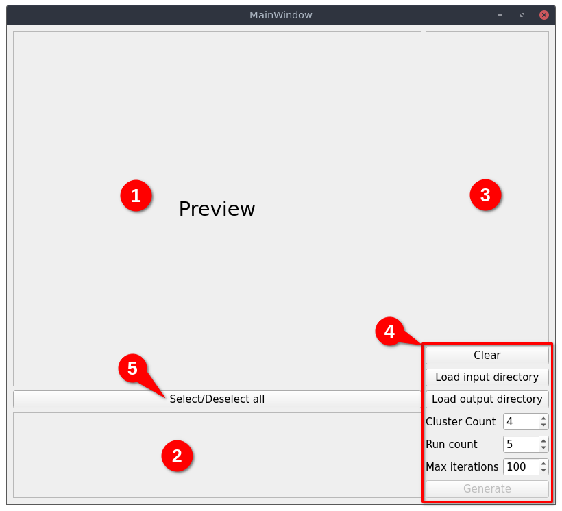

# Usage of the TAT GUI

## Starting the application

Before starting, make sure you installed it using [this guide](installation.md).
To start the application, you need to execute the following command in a command line interface:

```shell
python -m tat
```

!!! note
    An installer for Windows will be available in a future release, implying that an executable file will be shipped.

## Main window

### Container frames



There is 3 frames distinguishable:

1. The preview frame: this is where the selected image will show up when the user select both an image or a cluster.
2. The source frame: this is where all thumbnails of input images will show up. A thumbnail is a clickable widget that will preview the corresponding image in the preview frame, it can also be checked implying that the image will be processed by the clustering.
3. The clusters frame: this is where all the processed clusters will show up as thumbnail. In contrast to a source thumbnail, this one cannot be checked, but the user can double-click on it to open the [cluster editor](#cluster-editor).

### Clustering functions

In the right bottom corner (in the red rectangle labeled as **4** on the screenshot) there is a list of button and fields that are associated with the clustering area (number 3). Here is a list of the functions of each button and field:

- **Clear**: clear the clustering area (3 in [container frames](#container-frames))
- **Load input directory**: open a popup to select where the directory containing source images are located
- **Load output directory**: open a popup to select the directory where the clustering will be saved.
- **Cluster Count**: specify how much clusters you want to generate for each image, i.e. the number of output layers
- **Run count**: specify the number of run the algorithm must be run. Default is 5, you can increase if you need more precise results, or decrease if the computing time is to high
- **Max iterations**: specify the maximum number of iterations the algorithm must be run. Default is 100, you can increase it for more precise results, or decrease it for faster execution
- **Generate**: this button will start the computation algorithm for clustering. It may take a while, and a progress bar will show up to indicate to the user the progress of the program in the task. You can cancel the clustering by clicking on the **Cancel** button below the progress bar.

## Cluster editor
